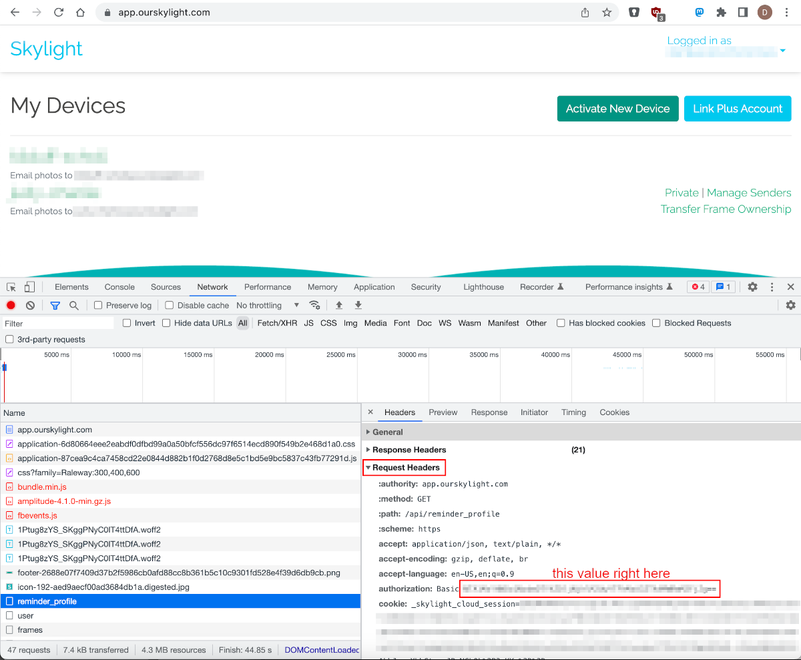

# Skylight Scraper

Skylight Scraper is a small Python 3 script that syncs photos from a Skylight digital picture frame to a local directory. This can be useful for backing up your photos or for mirroring your Skylight photo albums to another platform. Personally, I wrote it to mirror my Skylight photos to my Nextcloud server, giving me a way to share my photos with people without Skylight frames.

## Setup

```
$ git clone https://acab.enterprises/dismantl/skylight-scraper.git
$ cd skylight-scraper
$ pip install -r requirements.txt
```

## Running

In order to run the script, you'll need two pieces of data. The first is the numeric ID of the picture frame you want to download photos from. This is in the URL when you view the frame on the Skylight website, e.g. `https://app.ourskylight.com/frames/<FRAME_ID>/messages`. The second piece of data you'll need is your authorization string. This can be found by going to the Skylight website and logging in, and then viewing any of the AJAX requests for the `Authorization` header. The screenshot below shows how to find this string in Chrome developer tools; the string you want is base64-encoded and don't include the `Basic` prefix.



Once you have those pieces of data, you can start syncing photos from that frame to a local directory:

```
$ python3 scraper.py -h
usage: Skylight Scraper [-h] -f FRAME -a AUTH -o OUTPUT

Syncs photos from a Skylight frame to a local directory

optional arguments:
  -h, --help            show this help message and exit
  -f FRAME, --frame FRAME
                        Numeric ID of the frame to download from
  -a AUTH, --auth AUTH  Base64 string from Authorization header
  -o OUTPUT, --output OUTPUT
                        Directory to download photos to
```